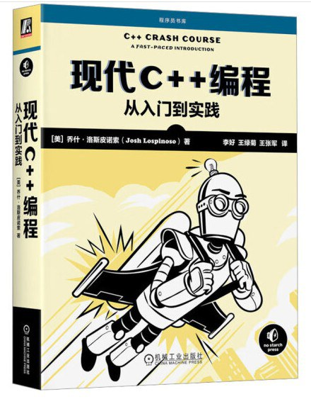

# 现代 C++编程：从入门到实践 中文版原书代码和习题解答

**2023** 年出版的新书，深入介绍了**现代 C++**（C++11 以上） 的核心。本书分为两大部分：

- 第一部分介绍 **C++语言的核心**:：深入讲解从类型和函数到对象生命周期和表达式的所有内容。
- 第二部分介绍 **C++标准库和 Boost 库**：深入讲解所有可用的高质量、全功能的工具，涵盖了特殊的工具类、数据结构和算法，并介绍了如何操作文件系统和构建通过网络进行通信的高性能程序。

本项目是《**现代 C++编程：从入门到实践**》的学习仓库，包括笔记和我所给出的课后练习答案。

## 目录

**第一部分：C++语言核心**：

- [第 1 章 启动和运行](booknotes/chapter01.md) | ([课后练习答案](practice/chapter01/README.md))
- [第 2 章 类型](booknotes/chapter02.md) | ([课后练习答案](practice/chapter02/README.md))
- [第 3 章 引用类型](booknotes/chapter03.md) | ([课后练习答案](practice/chapter03/README.md))
- [第 4 章 对象的生命周期](booknotes/chapter04.md) | ([课后练习答案](practice/chapter04/README.md))
- [第 4 章 对象的生命周期](booknotes/chapter04.md) | ([课后练习答案](practice/chapter04/README.md))
- [第 5 章 运行时多态](booknotes/chapter05.md) | ([课后练习答案](practice/chapter05/README.md))
- [第 6 章 编译时多态](booknotes/chapter06.md) | ([课后练习答案](practice/chapter06/README.md))
- [第 7 章 表达式](booknotes/chapter07.md) | ([课后练习答案](practice/chapter07/README.md))
- [第 8 章 语句](booknotes/chapter08.md) | ([课后练习答案](practice/chapter08/README.md))
- [第 9 章 函数](booknotes/chapter09.md) | ([课后练习答案](practice/chapter09/README.md))

**第二部分：C++库和框架**：

- [第 10 章 测试](booknotes/chapter10.md) | ([课后练习答案](practice/chapter10/README.md))
