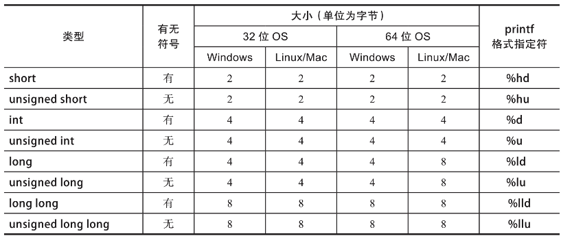

# 基本类型

C++程序中的每个对象都有一个类型。

C++中的基本类型（内置类型）包括：整数、浮点数、字符、布尔、byte、size_t、void。

**整数类型**

整数字面量可以包含任何数量的单引号(')，以方便阅读。编译器会完全忽略这些引号。例如，1000000和1'000'000都是表示一百万的字面量。

有时，打印无符号整数的十六进制表示或八进制表示（较少见）是很有用的。我们可以使用printf格式指定符%x和%o实现这个目的。

**浮点类型**：`float`、`double`、`long double`

**字符类型**：`char`、`char16_t`、`char32_t`、`signed char`、`unsigned char`、`wchar_t`

如果字符是`char`以外的其他类型，还必须提供一个前缀：L 代表`wchar_t`，u 代表`char16_t`，而 U 代表`char32_t`。例如，'J' 声明一个`char`字面量，L'J' 声明一个`wchar_t`字面量。

**转义字符**

Unicode转义字符：使用通用字符名的方式有两种：前缀\u加后面4位的Unicode码位，或前缀\U加后面8位的Unicode码位。例如，可以将A字符表示为'\u0041'，将啤酒杯字符㊣表示为U'\U0001F37A'。

char的printf格式指定符为%c。wchar_t的格式指定符是%lc。

**布尔类型**：`true`、`false`

比较运算符

逻辑运算符

**std::byte类型**定义在`<cstddef>`头文件中。通常用于表示原始内存的类型。原始内存是一个没有类型的位(bit)集合。

**std::size_t类型**定义在`<cstddef>`头文件中，用来表示对象的大小。size_t 对象保证其最大值足以代表所有对象的最大字节数。

`sizeof`运算符

size_t 的格式指定符通常是%zd（十进制表示）或%zx（十六进制表示）。

**void类型**：我们只在特殊情况下使用void，比如用作不返回任何值的函数的返回类型。

# 数组

声明数组

访问数组元素

`for`循环：普通for、增强for

数组长度计算

C风格的字符串：字符数组

# 用户自定义类型

枚举类型：枚举类型可以取的值被限制在一组可能的值中。枚举类型是对分类概念进行建模的最佳选择。

类：功能更全面的类型，它使我们可以灵活地结合数据和函数。只包含数据的类被称为普通数据类(Plain-Old-Data，POD)。

联合体：浓缩的用户自定义类型。所有成员共享同一个内存位置。联合体本身很危险，容易被滥用。

## 枚举类型

使用关键字`enum class`来声明枚举类型，关键字后面是类型名称和它可以取的值的列表。在实现内部，这些值只是**整数**。

使用类型的名称后跟两个冒号::和所需的值对枚举变量初始化。

非作用域枚举已经不建议使用。

**Switch语句**：每个case语句都以case关键字开头，后面跟着枚举值或整数值。每个case的大括号可有可无，但强烈推荐使用。

## 普通数据类

POD是简单的容器。我们可以把它们看作一种潜在的不同类型的元素的异构数组。类的每个元素都被称为一个成员(member)。每个POD都以关键词`struct`开头，后面跟着POD的名称，再后面要列出成员的类型和名称。

声明POD变量就像声明其他变量一样：通过类型和名称。我们可以使用点运算符(.)访问变量的成员。

C++保证成员在内存中是按顺序排列的，尽管有些实现要求成员沿着字的边界对齐，这取决于CPU寄存器的长度。一般来说，应该在POD定义中从大到小排列成员。

## 联合体

联合体(union)类似于POD，它把所有的成员放在同一个地方。我们可以把联合体看作对内存块的不同看法或解释。它们在一些底层情况下是很有用的，例如，处理必须在不同架构下保持一致的结构时，处理与C/C++互操作有关的类型检查问题时，甚至在包装位域(bitfield)时。

用`union`关键字代替`struct `声明联合体。

# 全功能的C++类

## 方法

在C++中，向类定义添加方法和访问控制即可实现封装。

方法就是成员函数。它们在类、其数据成员和一些代码之间建立了明确的联系。定义方法就像在类的定义中加入函数一样简单。

方法可以访问类的所有成员。

## 访问控制

访问控制可以限制类成员的访问。公有和私有是两个主要的访问控制。任何人都可以访问公有成员，但只有类自身可以访问其私有成员。所有的`struct`成员**默认都是公有**的。

可以用`class`关键字**代替struct**关键字，`class`关键字**默认成员声明为private**。除了默认的访问控制外，用struct和class关键字声明的类是一样的。

## 构造函数

构造函数是具有特殊声明的特殊方法。构造函数声明不包含返回类型，其名称与类的名称一致。

无参数构造、有参数构造

## 初始化

**将基本类型初始化为零**：四种方式。

使用字面量明确地设置对象的值，使用大括号{}，以及使用等号加大括号(={})的方法。**声明对象时没有额外的符号是不可靠的，它只在某些情况下有效。**

使用大括号{}初始化变量的方法被称为大括号初始化。

**将基本类型初始化为任意值**：四种方式

使用等号的初始化，使用大括号初始化，使用等号加大括号的初始化，以及使用**小括号的初始化**。

**初始化POD**

初始化POD的语法大多遵循基本类型的初始化语法。

将POD对象初始化为零与将基本类型的对象初始化为零类似。大括号初始化和等号加大括号的初始化产生相同的代码：字段初始化为零。

不能对POD使用“等于0”的初始化方法。

**将POD初始化为任意值**

可以使用括号内的初始化列表将字段初始化为任意值。大括号初始化列表中的参数必须与POD成员的类型相匹配。从左到右的参数顺序与从上到下的成员顺序一致。**只能从右到左省略字段**，任何省略的成员都被设置为零。

等号加大括号的初始化工作方式与此相同。**不能使用小括号来初始化POD。**

**初始化数组**

可以像初始化POD一样初始化数组。数组声明和POD声明的主要区别是，数组指定了长度，这个长度参数在方括号[]中。

当使用大括号初始化列表来初始化数组时，长度参数变得可有可无，因为编译器可以从初始化列表参数的数量推断出长度参数。

**全功能类的初始化**

与基本类型和POD不同，**全功能类总是被初始化。**换句话说，一个全功能类的构造函数总是在初始化时被调用。具体是哪个构造函数被调用取决于初始化时给出的参数。

**缩小转换**

使用大括号初始化时，遇到隐式缩小转换，编译器会产生一个警告。但小括号初始化不会产生警告。

**初始化类成员**

可以使用大括号初始化来初始化类的成员，**不能使用小括号来初始化成员变量**。

**总结**

有一条使初始化变得简单的一般规则：**在任何地方都使用大括号初始化方法。**

大括号初始化方法几乎在任何地方都能正常工作，而且它们引起的意外也最少。由于这个原因，大括号初始化也被称为“统一初始化”。

## 析构函数

对象的析构函数是其清理函数。**析构函数在销毁对象之前被调用**。析构函数几乎不会被明确地调用：编译器将确保每个对象的析构函数在适当的时机被调用。我们可以在类的名称前加上“~”来声明该类的析构函数。

析构函数的定义是可选的。如果决定实现一个析构函数，它不能接受任何参数。

在析构函数中执行的操作包括**释放文件句柄**、**刷新网络套接字(socket)**和**释放动态对象**。

如果没有定义析构函数，则会**自动生成默认的析构函数**。默认析构函数的行为是**不执行任何操作**。

