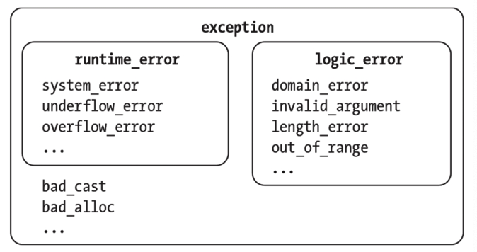

# 对象的存储期

对象是一段**存储空间**，它有类型和值。

变量是具有名字的对象。

## 分配、释放和生命周期

为对象保留存储空间的过程叫作**分配**(allocation)。当使用完对象后，释放对象的存储空间的过程叫作**释放**(deallocation)。

对象的**存储期**(storage duration)从对象被分配存储空间时开始，到对象被释放时结束。

对象的**生命周期**从构造函数运行完成时开始，在调用析构函数之前结束。

每个对象都会经历以下几个阶段：

1. 对象的存储期开始，并分配存储空间。
2. 对象的构造函数被调用。
3. 对象的生命周期开始。
4. 在程序中使用该对象。
5. 对象的生命周期结束。
6. 对象的析构函数被调用。
7. 对象的存储期结束，存储空间被释放。

## 内存管理

Java程序在运行期间，会创建对象。**垃圾收集器**会定期确定哪些对象不再被程序所需要，并安全地将它们释放。

C++要求对存储期有深入理解，控制对象生命周期是程序员的责任，而不是垃圾收集器的责任。

## 自动存储期

自动对象在代码块的开头被分配，而在结尾处会释放。

代码块就是自动对象的作用域。自动对象具有自动存储期。

注意，**函数的参数是自动对象**，尽管从符号上来看它们出现在函数体之外。

自动变量也被称为**局部变量**。

## 静态存储期

静态对象是用`static`或`extern`关键字来声明的。

在声明函数的同一范围内声明静态变量，这一范围即全局作用域（或命名空间作用域）。

全局作用域的静态对象具有**静态存储期**，在程序启动时分配，在程序停止时释放。

使用`static`关键字可以指定内部链接(internal linkage)。内部链接意味着变量**不能被其他编译单元访问**。

也可以指定**外部链接**(external linkage)，使变量可以被其他编译单元访问。对于外部链接，我们使用`extern`关键字而不是static关键字。

**局部静态变量**：一种特殊的静态变量

局部静态变量是在函数作用域声明的，就像自动变量一样。但是它们的生命周期从包含它的函数的第一次调用开始，直到程序退出时结束。

**静态成员**：不与任何实例关联。所有实例共享同一个静态成员。

类似于在全局作用域中声明的静态变量和函数，但是我们必须使用类的名称加上作用域解析运算符::来引用它们。

事实上，我们**必须在全局作用域初始化静态成员**。不能在类定义中初始化静态成员。除非它们被限定为`const`。

## 线程局部存储期

**并发程序的基本概念之一是线程**。每个程序都有一个或多个线程，它们可以执行独立的操作。

线程执行的指令序列称为它的**线程执行**(threadof execution)。

在使用多个线程执行时必须采取额外的预防措施。多个线程能够安全执行的代码称为**线程安全代码**。

可变全局变量是许多线程安全问题的根源。有时，我们可以通过为每个线程**提供单独的变量副本**来避免。这可以通过**指定具有线程存储期的对象**来实现。

可以通过在`static`或`extern`关键字之外添加`thread_local`关键字来修改具有静态存储期的变量，使其具有**线程局部存储期**。如果只指定了thread_local，则**隐含static声明**。变量的链接方式不变。

## 动态存储期

具有动态存储期的对象会**根据请求进行分配和释放**。我们可以**手动控制**动态对象生命周期何时开始，何时结束。为此，动态对象也被称为**分配对象**(allocated object)。

分配动态对象的主要方式是使用`new`表达式。`new`表达式的开头是`new`关键字，后面跟着动态对象的类型。`new`表达式创建给定类型的对象，然后**返回指向新创建的对象的指针**。

使用`delete`表达式来释放动态对象，`delete`表达式总是返回`void`。

通常情况下，**被释放的对象的内存将保持不变**，直到程序将其重新用于其他目的。因此可能不得不实现自定义的析构函数来将一些敏感的内容清空。

**动态数组**：使用`new`表达式声明的数组。

必须确保分配的动态对象也能被释放。如果不能被释放，就会导致**内存泄漏**，即程序不再需要的内存没有被释放。

如果编写的是用户模式的代码，现代操作系统会在程序退出时清理资源。

如果编写的是内核代码，操作系统将不会清理资源，只有在计算机重启时才会回收资源。

# 异常

当错误发生时，抛出一个异常。程序停止正常的执行过程，并寻找能够管理该异常的异常处理程序。在这个过程中，**离开作用域的对象会被销毁**。

传递错误的另一种方法是将错误码作为函数原型的一部分返回。

## throw关键字

要抛出异常，需使用`throw`关键字，后面跟着一个可抛出对象。大多数对象都是可抛出的。

但最好使用`stdlib`中的异常之一，比如`<stdexcept>`头文件中的`std::runtime_error`。

## 使用try-catch代码块

使用`try-catch`块为代码块建立异常处理程序。在`try`块中放置可能抛出异常的代码。在`catch`块中为每一种可以处理的异常类型指定处理程序。

## 继承

异常机制使用继承关系来决定处理程序是否捕获异常。

处理程序将捕获**给定的类型**和**它的任何父类型**。

## stdlib异常类

`stdlib`在`<stdexcept>`头文件中提供了**标准异常类**。

所有标准异常类的父类都是`std::exception`类。`std::exception`的所有子类都可以划分为**三组**：**逻辑错误**、**运行时错误**和**语言支持错误**。虽然语言支持错误一般与程序员无关，但你肯定会遇到逻辑错误和运行时错误。

**逻辑错误**来源于`logic_error`类，如果失败的原因是向构造函数传递了不正确的参数，那么`logic_error`是一个适合拋出的异常。

`domain_error`报告与**有效输入范围有关的错误**，特别是对于数学函数。

`invalid_argument`报告意外的参数错误。

`length_error`报告某些操作违反了最大尺寸约束。

`out_of_range`报告某些值不在预期范围内。

**运行时错误**来源于`runtime_error`类。这些异常可以报告程序作用域之外的错误。

`system_error`报告操作系统遇到的一些错误。`.code()`方法返回类型为`std::errc`的枚举类，这个类包含大量的错误码，如`bad_file_descriptor`、`timed_out`和`permission_denied`。

`overflow_error`和`underflow_error`分别报告算术上溢出和下溢出。

其他错误直接继承自`exception`类，一个常见的异常是`bad_alloc`，它报告new未能成功分配所需动态内存。

**捕获任何异常**：`catch(...)`

## 用户定义的异常

通常，这些用户定义的异常继承自`std::exception`。

可以而且应该将**不可能抛出异常的函数**标记为`noexcept`

将函数标记为`noexcept`可以帮助优化代码，这些优化要求函数不抛出异常。

## 调用栈和异常

运行时会寻找最接近抛出的异常的异常处理程序。

如果当前的栈帧中有匹配的异常处理程序，它将处理该异常。如果没有找到匹配的异常处理程序，运行时将展开调用栈，直到找到合适的处理程序。

这个过程中，任何生命周期要结束的对象都会正常地被销毁。

**不要在析构函数中抛出异常**。一般来说，要把析构函数当作`noexcept`函数

